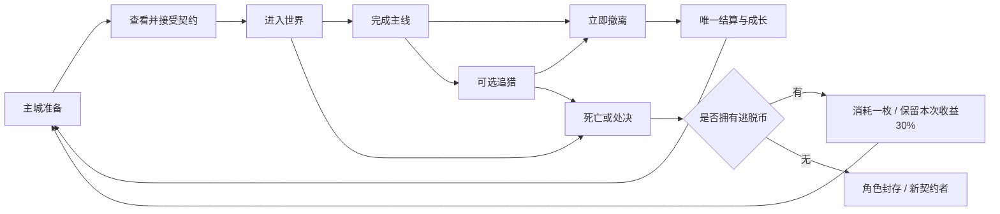

# HD2D《轮回乐园》题材游戏规划文档

版本：v0.4 · 日期：2026-09-16 · 状态：P1 范围已锁定，待制作与试玩验证

本文依据用户提供的规则提炼与当前 Godot 工程源码制定，不作为原著考据。所有关卡、公式、数值与排期均为游戏设计建议，不是原著事实或已实现功能。本次只更新文档，不修改游戏代码。

旧规划保存在 [GDD_legacy_20260916.md](GDD_legacy_20260916.md)；P1 的保留、降级与禁止新增以 [P1_SCOPE_BASELINE.md](P1_SCOPE_BASELINE.md) 为准；开发顺序见 [IMPLEMENTATION_PLAN.md](IMPLEMENTATION_PLAN.md)。辅助策划材料中的不同提案不自动成为执行规则。

## 1. 游戏定位

**PC 单人、俯视 HD2D、近战技法主导的世界任务制动作 RPG。** 玩家作为猎杀者，在安全主城准备，进入危险世界履行契约，在资源、情报和生存之间做选择，活着撤离后将战利品转化为永久成长。

肉鸽元素用于遭遇、奖励和路线变化；同一角色可以连续经历多个世界。死亡时有逃脱币则消耗一枚、保留角色与存档，以损失本次收益的 70% 为代价返回主城；无币才进入永久死亡。

### 四个设计支柱

| 支柱 | 玩家体验 | 设计要求 |
|---|---|---|
| 等价交换 | 用币补给、用结晶学技法、用时间与风险争取更多收益 | 选择前知道主要成本；不以繁琐收费替代选择 |
| 技法优先 | 读招、闪避、打破绽、借助地形逆转差距 | 操作和情报能降低风险，属性不能买断所有风险 |
| 有限情报 | 付费买情报或冒险侦查，直感只提示危险 | 不隐藏任务惩罚；大伤害攻击仍有可辨前摇 |
| 契约压力 | 身份既提供权限，也带来必须履行的义务 | 强制任务与可选悬赏明确区分 |

战斗风险、探索时间和物资消耗都是代价。任务奖励已由履约支付成本，不需要获得奖励时再扣一次钱。

### 默认方案与假设

- Windows PC、键鼠、单人离线；手柄后续适配。
- 使用用户目前自建的角色，沿用现有资产与形象，不另建或替换主角。
- 首世界为原创“灰潮隔离港”，采用乐园式规则；暂不制作大量动漫衍生世界。
- 固定斜俯视镜头，3D 场景与碰撞 + 2D 像素角色，延续现有技术方向。
- 正式契约加入低价逃脱币：有币死亡保档并保留本次收益的 30%，无币永久死亡；独立试炼不产出正式资源。
- 首版不做联网 PVP、无缝大世界、完整冒险团、四名从者和十一档品质。

用户已确认的决定见第 15 节。逃脱币是明确采用的游戏改编，优先于原著永久死亡设定；其余细节仍为建议。实际投入与对外题材名称暂缓，不据此锁定排期或发布安排。

## 2. 当前基础与缺口

以下来自本轮静态源码检查，未进行运行测试。

| 模块 | 已有证据 | 尚缺内容 |
|---|---|---|
| 工程 | `project.godot` 标记 4.7 / Forward Plus、Jolt、1920×1080 | 实际性能、发布配置与最低硬件尚未验证 |
| 地图镜头 | `scenes/main/main.tscn` 的地面、光源、跟随镜头 | 当前为测试场，没有完整关卡 |
| 玩家 | `player.gd` 有移动、扇形攻击、闪避、HP、连击变量 | 前摇/有效帧/后摇、输入缓冲、状态互斥 |
| 角色显示 | `player.tscn`、`scripts/player/player_visual.gd` 接入四方向动画选择与翻转 | 逐动作校准锚点、朝向与命中帧 |
| 敌人 | `scripts/combat/enemy.gd` 追击、距离攻击、击退、掉币 | 预警、导航、不同职能、精英和 Boss |
| HUD | `scripts/ui/hud.gd` 的生命条、币、蓝色消息 | MP、任务、技能、日志、结算界面 |
| 状态 | `autoload/game_state.gd` 的内存币值和消息信号 | 无持久化存档、库存、属性与经济事务 |
| 流程 | `scripts/main/main.gd` 死亡原地重置并刷怪 | 无真实主城、正式死亡、任务或撤离结算 |

### 优先修正

1. 连段续接窗口为 0.40 秒，攻击冷却为 0.42 秒，按当前计时逻辑，下一次攻击可用时连段窗口已结束。先修正窗口与输入缓冲，不将“三连击变量存在”等同于手感已完成。
2. 当前伤害在按下攻击时即时扫描，未绑定刀刃有效帧；应由动作时间轴统一驱动表现与判定。
3. 死亡提示“执行处决：灵魂回收，返回主城”与实际演示重置、以及永久死亡规则均不一致。需拆成试炼重置、撤离、战死、处决四种结果。
4. 玩家物理循环缺少统一死亡态输入拦截。重置时须清理闪避、冷却、输入和延迟回调，避免旧计时器污染新状态。
5. 近战扫描没有墙体遮挡检查；正式地图中必须防止隔墙命中。

保留当前移动和角色显示基础，先把测试场做成可靠的战斗房间。

## 3. 核心循环

| 时间尺度 | 循环 | 主要体验 |
|---|---|---|
| 3～10 秒 | 观察前摇 → 调位/闪避 → 攻击空隙 → 追击或收手 | 技法与命中反馈 |
| 2～5 分钟 | 遭遇 → 消耗补给 → 获得资源/情报 → 选路线 | 局部风险取舍 |
| 20～30 分钟 | 主城准备 → 世界主线 → 可选追猎 → 撤离结算 | 带战利品活着回来 |
| 多次出击 | 属性/装备/技法成长 → 权限与晋升 → 新世界 | 持续构筑与探索 |



首个切片的核心问题：**主线已经完成，是否值得用剩余生命、药剂和时间追猎违规者，换取稀缺结晶？**

准备阶段让玩家在药剂和情报之间花钱；中途通过探索获得替代情报；主线后开放固定撤离点。可选猎杀可放弃，强制猎杀不得放弃，两者不得共用含混任务标签。切片只制作可选悬赏，强制义务在后续晋升内容中验证。

## 4. 原设定的游戏化取舍

| 原规则主题 | 本项目方案 | 阶段 |
|---|---|---|
| 等价交换与蓝色提示 | 所有经济操作由规则系统确认，再显示权威结果；提示文本不反向驱动逻辑 | 切片 |
| 灵魂契约 | 不可随意取消；允许暂停和退出续玩，不能撤销已经确认的死亡 | 切片 |
| 权限等级 | 用身份、阶位和权限标签决定情报/功能，不将所有身份机械排成一条等级链 | 切片基础 |
| 六维及隐藏属性 | P1 仅力量/敏捷/体力/智力生效；魅力/幸运只保留字段；灵魂与血气只留接口 | 切片基础 |
| 世界之源 | 独立结算资源，世界内积累、撤离入账、兑换扣余额，不放人物六维栏 | 切片 |
| 高阶强化损毁 | 切片 +1～+3 必成，高阶才开放风险，并预告概率与损失 | 后续 |
| 技法、天赋、称号 | 一条刀术线、一个核心天赋和一个称号起步 | 切片基础 |
| 世界限制 | 首版只限制战斗药剂携带数，后续逐项增加封印、压制 | 切片基础 |
| 多乐园争夺 | 先用 AI 契约者营造竞争；真正联网另行立项 | 中远期 |
| 霸主临时模板 | 标记所属世界实例，离开即清除，不能写入基础属性 | 后续 |
| 团队与从者 | 从一名侦查从者开始，再加坦克与团队被动 | 后续 |
| 死亡与逃脱 | 低价购买逃脱币；死亡有币保档、消耗一枚、收益减少 70%；无币永久死亡 | 切片 |

用户提供的品质序列、晋升资格、职工者来源等作为参考素材，未核验原著。最终实现以项目显式配置为准；未制作的功能不铺满菜单占位。

## 5. 战斗规格

### 5.1 首版动作

| 操作 | 设计初值（括号内为引擎现值） | 战术用途 |
|---|---|---|
| WASD | 引擎现值 2.6 + (敏捷−5)×0.04，新档敏捷 7 → 2.68 | 调位、利用地形 |
| 鼠标左键 | 引擎现值为单段斩击：0.6 秒冷却、0.24 秒命中帧、1.3 倍伤害 | 交替斜劈与横斩，试探和寻找破绽 |
| 鼠标右键 | 设计为双枪远程骚扰，弹药与单发伤害待定；引擎只实装了单发「破旧燧发枪」：6 发、单发 2~13 区间双 roll、间隔 1.8 秒、探测 22 米窄锥 | 远程物理骚扰，逼敌人消耗能量 |
| Q 青钢影・猎魔 | 按秒消耗法力；对能量敌人造成真实伤害；法力低于 1% 强制关闭（引擎：命中附加目标最大生命 2% 的真伤、4.0 MP/秒，仅对有能量敌人生效，目前只吃平A命中） | 抓破绽后的真伤爆发窗口 |
| E 青钢影・傲歌 | 吸收上限、持续时限与法力消耗待定；复用现有护盾表现（引擎：14 MP、冷却 8 秒、持续 5 秒、上限 min(100, 25+智力×2)） | 用法力换容错，可主动撤销 |
| R 刀芒 | 起测沿用的 25 MP / 冷却 4 秒 / 2.8 倍**已废弃**；引擎现值 12 MP / 冷却 2.5 秒 / 0.9 倍 / 射程 9.0 米；**已确认不做削韧** | 中距离消耗，不造成真实伤害 |
| F 环断 | 原地环形范围，法力消耗高于刀芒；数值待定（引擎：1.2 倍、24 MP、冷却 4.5 秒、半径 4.2 米） | 处理复数包围 |
| T 影刺 | 仅反手刺击命中后可用；空放无效且不扣法力；伤害待定（引擎：0.8 倍 + 16 真伤、18 MP 空放全额返还、冷却 3 秒、距离 ≤4 米；真伤仅对有能量目标） | 近身爆发，禁止空放 |
| Left-Shift 剃（六式・剃） | 蓄力下蹲 0.15 秒（此段无敌）→ 爆发 0.32 秒 → 落地骤停 0.08 秒，合计 0.55 秒位移约 6.5 米、冷却 2.2 秒 | 高速物理爆发位移；踩地借力，悬空不可释放，撞墙即停 |
| 数字 1 炼金炸弹 | 库存与伤害待定；爆炸有预警（引擎：固定 90 伤害、半径 4.5 米、落地布防 0.25 秒 + 触发引信 0.35 秒、投掷最远 11 米；库存 = 火药陷阱持有量） | 投掷输出或地面预埋陷阱 |
| 数字 2 药剂 | 回复 45 HP、携带 2 瓶；使用动作时长待定（引擎：非战役回 45 HP，战役回最大生命 40%÷本次使用次数、读条 1.2 秒、受击打断不返还） | 补给与安全窗口管理 |
| V / Esc | 交互 / 面板 | 服务、任务、查看状态 |
| 无按键 拼刀格挡 | 双方近战有效帧重叠时触发；窗口、弹开与冷却待校准（引擎：重叠 ≤0.3 秒、敌硬直 0.8 秒、弹开初速 8.0、免疫 0.35 秒、玩家冷却 0.9 秒） | 不耗法力的近战对拼手段 |

本表为设计初值；按键与技能集的范围裁决以 [P1_SCOPE_BASELINE.md](P1_SCOPE_BASELINE.md) v1.1 第 1 节为准。引擎现值与设计值的逐项对照、技能数值和实现入口见 [REALTIME_COMBAT_EXTRACTION.md](REALTIME_COMBAT_EXTRACTION.md)。

**已确认：按鼠标点击方向攻击，WASD 只控制移动。** 点击位置投影到角色所在战斗平面，由角色指向点击点的水平向量决定攻击方向。每段连击采样对应点击，输入缓冲保存方向，前摇开始后锁定本段方向；移动不能覆盖攻击方向。现有四向素材选择最接近朝向，实际命中使用连续方向。点击 UI 不攻击；点击脚下导致方向过短时使用上次有效方向。方向技能按下技能键时读取鼠标位置。

药剂在使用动作完成时扣除并回血，被打断则无效果且不消耗。

### 5.2 动作与命中

- 动作分前摇、有效帧、后摇。单次攻击分配 `attack_id`，同一目标仅被该攻击命中一次。
- 有效帧检查范围、角度、碰撞层和遮挡。动画播放与逻辑时间轴保持一致，不能由画面帧率决定伤害次数。
- 输入缓冲以 0.15 秒起测；续接窗口相对后摇定义。第三段不能任意取消，前两段只在允许窗口闪避取消。
- 轻敌人可打断，重甲具韧性，Boss 在指定破绽可打断；避免普攻无限硬直。
- 命中停顿使用单一强度起测，屏幕震动只做单一强度和全局开关。危险攻击通过动作、声音、地面形状共同表达。

### 5.3 统一伤害链

`命中合法 → 无敌/闪避 → 攻击快照 → 分类型减免 → 可吸收护盾 → HP → 韧性/硬直 → 致死 → 掉落与任务事件 → 提示`

- 物理伤害：设计式为 `基础物理 × 技能倍率 × 100 / (100 + max(护甲, 0))`；**引擎现值为百分比累加减免**：`敌方伤害 × (1 − 护甲总减免) × clamp(1 − (体力−5)×0.03, 0.7, 1.18)`，各槽 `def_pct` 求和后 clamp 0~0.9（`game_state.gd` / `player.gd`）。
- 真实伤害：跳过护甲，读取真实抗性；不自动跳过无敌或闪避。
- 灵魂伤害：跳过肉体护甲，读取灵魂抗性；精神异常另行判定，切片不做随机即死。
- 傲歌护盾吸收物理/能量，不吸收真实/灵魂伤害；有吸收上限与持续时限，不能无限常驻，被击破有短硬直，首版不再追加隐藏震荡伤害。
- P1 投放物理伤害，并对拥有能量的敌人开放真实伤害（青钢影・猎魔）；灵魂伤害仍只保留枚举、事件字段和规则测试接口，不制作对应技能、敌人和 UI。上述为游戏改编规则。

法力是青钢影的核心资源：开启猎魔持续消耗，低于 1% 强制关闭；法力主要来源是击杀拥有能量的敌人（噬灵者），击杀纯肉体敌人不回复，P1 不投放大量回蓝药剂。战斗中另有战斗回蓝：**每次命中敌人回复最大法力的 1%，并每秒被动回复 0.2%**（战役与试炼场统一，2026-09-19 起替换原「战役 3/小时、试炼场 12/秒」双轨）。敌人数据必须标注有能量 / 无能量，青钢影与噬灵者对两类敌人的表现不同。

血气放到后续：只有敌人造成的有效 HP 损失积累，自伤、友方与重复环境伤害不计入；每次出击重置，防止无风险自残刷资源。奥义再以高血气/法力消耗和长冷却接入，不先堆多种爆发条。

## 6. 属性、技能与构筑

起始六维的设计模板为统一 5，作为本项目模板；**引擎新档现值为 `{力量 6, 敏捷 7, 体力 5, 智力 6, 魅力 3, 幸运 1}`**（`data/campaign.gd`），与统一 5 的模板不同。此数值不表示原著魅力、幸运必须使用普通人的同一尺度。首版只允许用属性点提高力量、敏捷、体力、智力。

| 属性 | 首版作用 | 边界 |
|---|---|---|
| 力量 | 非战役：攻击 = 武器基础 7 + 力量（模板 5 → 12）；战役：攻击 = (武器区间中点 × 力量倍率 + max(力量−5, 0)) × (1+0.1×刀术训练) | 不同时线性提高攻速和全部技能系数 |
| 敏捷 | 移速 = 2.6 + (敏捷−5)×0.04；剃冷却 = clamp(2.2 − (敏捷−5)×0.08, 1.4, 2.6) | P1 不改变攻击速度、输入缓冲、闪避时长或无敌窗 |
| 体力 | 最大 HP = 50 + 体力×10；战役受击系数 = clamp(1 − (体力−5)×0.03, 0.7, 1.18)；体力条上限 = 60 + 体力×12 | 永久上限损伤独立记录，切场不恢复 |
| 智力 | 最大 MP = 智力×10 + 永久噬灵者收益；傲歌护盾 = min(100, 20 + 智力×4) | 世界内不自动回满，主城付费恢复 |
| 魅力 | 仅存档字段 | P1 完全不参与公式和事件 |
| 幸运 | 仅存档字段 | P1 完全不影响掉落、暴击或任务 |

灵魂强度、真实抗性在获得相关能力后显示。世界之源显示在世界成果与资源页；血气上线后才显示血气槽。

### 成长分工

- 属性提供承载能力，技法改变战斗效率，装备提供条件效果，天赋决定长期路线，称号适应特定任务。
- 刀术先做三个节点：基础三连击、终结斩削韧增强、闪避后首击增强。币与结晶升级，严格检查前置。
- 天赋先用改编占位“灵魂回响”：首次击败标记强敌得到有上限的灵魂碎片，用于天赋节点；不实现死者记忆系统和无限击杀成长。
- 直感后续通过首次完成危险挑战获得熟练度，同一敌人同招不能反复刷。
- 首个称号“灰潮清理者”提供港区情报折扣，只在主城切换；不迫使玩家战斗中不断暂停换称号。
- 灭法、炼金、枪械、召唤作为后续独立方向，不把所有原著能力一次性塞给角色。

中期用共通动作形成刀术进攻、青钢影生存（傲歌护盾与法力管理）、猎杀侦查三类取舍，先验证差异，再决定是否需要独立职业。

## 7. 经济与装备

### 7.1 资源分层

| 资源 | 主要来源 | 主要用途 | 结算边界 |
|---|---|---|---|
| 乐园币 | 普通遭遇、任务、售卖冗余装备 | 药剂、情报、恢复修复、基础升级 | 世界收益暂存，撤离入账 |
| 灵魂结晶 | 精英、Boss、猎杀 | 技法、后续高阶强化 | 切片只做“小”，不在币商店无限购买 |
| 世界之源 | 主线、独特世界目标 | 永久属性点，后续知识兑换 | 暂存成果→成功结算余额→兑换时扣除 |
| 灵魂碎片 | 天赋限定强敌事件 | 天赋节点 | 不与结晶或源点混用 ID |

P1 只实现以上四种成长资源。逃脱币属于商店保命消耗品，不构成第五种成长资源；猩红卡开启/拆解系统后置到 P2，P1 的可选悬赏直接结算固定资源与战利品二选一。

世界之源首版按整数“源点”显示，不套用未经核验的原著百分比。唯一结算按**世界实例**识别；重开一个合法新实例可以再次获得来源，不是整个角色一生只能通关同一个地图一次。单实例目标不复刷收益。

### 7.2 一局示例账本（待调参）

| 项目 | 币 | 小结晶 | 源点 |
|---|---:|---:|---:|
| 出发药剂×2 | -40 | 0 | 0 |
| 可选情报 | -20 | 0 | 0 |
| 8 次普通遭遇合计 | +80 | 0 | 0 |
| 主线精英 | +30 | +1 | +5 |
| Boss 战利品 | +50 | +1 | +10 |
| 主线任务奖励 | +40 | 0 | +10 |
| 回城恢复修复示例 | -20 | 0 | 0 |
| 基础净收益（买情报） | **+120** | **+2** | **+25** |
| 可选猎杀额外收益 | +60 | +1 | 0 |

P1 猎杀不额外给源点，奖励固定币、小结晶和一次战利品二选一，减少“为了核心属性必须追猎”的压力。Boss 掉落与主线奖励是不同来源，按各自 ID 发放，禁止重复派发。

20 源点换 1 永久属性点；一个刀术节点花 80 币 + 2 小结晶；武器 +1 花 60 币。第一局让玩家在技法、装备与下次补给之间取舍。

新契约者获得制式刀和 100 币签约预支，首次成功主线结算偿还 50 币，合同提前说明。首局上述净收益扣还款后为 70 币。预支不能跨角色转移；失败后新建角色也不能把其资源转交旧角色。

### 7.3 逃脱币与收益损失

- 已确认低价常规购买，不做稀有掉落限定。暂以 **10 乐园币/枚** 为测试建议，低于药剂的 20 币；具体价格尚未由用户指定。
- 有币死亡自动消耗一枚，结束本次出击并回城。保留角色、出发前资产与永久成长；已用药剂和已支付费用不退还。
- 减少 70% 指本次已获得、尚未结算的收益仅保留 30%，包括币、结晶、源点、灵魂碎片和战利品；不扣历史存款、原有装备和永久属性。未完成任务不补发奖励，救援不等于主线或晋升成功。
- 币和源点等可拆分收益按 30% 计算；整数取整，以及装备等不可拆分收益的留存/折算方式，经济实现前细化。不声称一件装备能精确保留 30%，也不能让全部贵重物品免于损失。
- 示例：本局获得 200 币，救援入账 60 币，历史余额不扣，逃脱币减少一枚。零收益也消耗一枚保档。扣币、折损与救援结果一次提交，不能重启重复扣除。
- 上节账本为正常撤离；若另外购买一枚逃脱币，按暂定价净收益从 120 降至 110 币，首局偿还预支后为 60 币。未使用的逃脱币保留，下次不重复购买。

### 7.4 装备最小范围

> **引擎现值对照（2026-09-19）**：装备槽 **11 位**（主武器/副手/头/躯干/护臂×2/足/披风/项链/戒指×2），非 8 槽；品质 5 档（白/绿/蓝/紫/淡金）+ 评分；可装备物品仅 **3 件**（普通匕首、斩龙闪、亡妻的项坠），防具类缺失；背包 **64 格**，非 12 格；强化 +0→+3 成功率为 98%/94%/88%，非确定成功；普通匕首 `can_sell`/`can_decompose` 均为 true。下方条目中的其余数字为设计目标。

- **8 槽（按佩戴部位，跟随小说原设）**：武器、躯干、护臂·左、护臂·右、鞋子、戒指（全手仅 1 枚）、项链、勋章（独立位，同类替换互斥）。详见 [NOVEL_CORE_SYSTEMS.md](NOVEL_CORE_SYSTEMS.md) §5.1。
- 白/绿/蓝 3 品质；8 件固定装备起步：3 把刀、2 件护甲（躯干/护臂占位）、3 件首饰/勋章。其余槽位后续世界逐步放开。
- 每件装备使用固定属性和唯一被动；P1 没有随机词条、随机数值区间或词缀重投。
- +1～+3 强化确定成功；以后高强化引入失败掉阶/损毁，并展示成功率和保护方式。进阶清空强化只在进阶系统上线后使用，操作前明确告知。
- 背包 12 格（存货等价于储蓄空间简化版），装备各 1 格、材料可堆叠，战斗药剂上限单独计算；先不做复杂负重模拟。
- 制式刀不可出售或销毁，损坏仍保留最低输出。主城无钱可通过服务委托换取最低补给，以时间支付代价，避免资源软锁。
- 首版无玩家交易与账户共享仓库，正式资源归属该契约者；角色死亡不能把财富继承给新角色。

## 8. 身份、任务与信息系统

玩家先只实现猎杀者。普通契约者、职工者、其他乐园成员作为 NPC；违规者是敌对标记，不是可选职业。

权限由身份、阶位、任务状态与能力标签共同决定，例如能否接取猎杀、查看高级情报。未解锁内容显示权限不足和可知的解锁条件，不能看起来像未完成按钮。

每个任务包含 ID、类型、前置、目标计数、期限、奖励、惩罚、可否放弃、是否阻止撤离。状态为：未解锁→可接→已接→可提交→已完成；失败/放弃为终态。完成与发奖分离且幂等。

| 类型 | 首版内容 | 失败与撤离 |
|---|---|---|
| 主线 | 恢复隔离装置、击败守门者、取得净化核心 | 未完成不能正常撤离；超时失败，致死结果先检查逃脱币 |
| 探索支线 | 获取维护记录、解锁泵房侧路 | 可不做，无惩罚 |
| 可选猎杀悬赏 | 击杀违规者“剥线人” | 可放弃，无对应奖励，不阻止撤离 |
| 强制猎杀 | 切片后加入 | 完成前封锁正常撤离，惩罚入场前说明 |
| 晋升任务 | 短篇完整版本加入一次 | 多环资格、资源与考核，单独配置 |

世界活动期限先设 35 分钟，主城、暂停、退出游戏不计时。主线完成后开放撤离；继续猎杀仍计时。到期未撤离触发失败，统一先检查逃脱币：有币保档并折损收益，无币终结角色。入场界面和主线完成提示均说明此规则。

### 情报与直感

- 基础权限显示主线、期限和撤离条件；付费情报揭示实用机制，例如守卫何时暴露核心。
- 支线侦查可获得相同情报，但消耗时间、增加遭遇；两条途径都能完成主线。
- 普通敌人显示完整/受伤/濒危三个生命区间，Boss 显示阶段与粗略分段；精确数值在试炼中查看。
- 直感用无方向边缘脉冲和音效提示特定危险，不显示敌人位置、数量或最优路线；有短冷却避免常亮。
- 使徒之眼的威胁光点侦查（白/绿/红/黑分级）不在 P1 范围，P1 的威胁提示只由直感承担，见 [P1_SCOPE_BASELINE.md](P1_SCOPE_BASELINE.md) 第 3 节。
- 高伤攻击仍保留明显前摇。危险提示不等于替玩家闪避，有限情报也不等于无法学习。
- 蓝色日志只陈述已确认事实，记录条件、原因和资源变化，关键合同警告可回看。

## 9. 首个世界：灰潮隔离港

原创世界，用暗灰港区、蓝色晶体装置与红色污染表达秩序、系统与危险。目标验证一条完整世界任务链，不复刻大规模原著战役。

```text
主城 → 入场码头 → 仓储巷道 → 泵房精英 → 隔离广场 Boss → 撤离信标
                    ├ 维护记录支线 → 侧门 ──────────┘
                    └ 猎杀线索 → 废弃船坞违规者 → 返回撤离路线
```

5 个主区域 + 2 个可选区域，手工制作；侧路改变遭遇，不能绕过主线必要物件。P1 使用固定房间和手工遭遇池，仅在房间内抽取少量预设敌人组合；不制作程序化地图。

| 敌人 | 初始数值 | 行为与对策 |
|---|---|---|
| 失控搬运工 | 40 HP / 10 伤害 | 明显挥击前摇，可打断，教轻击与闪避 |
| 港区射手 | 30 HP / 12 伤害 | 瞄准后射击、保持距离，教掩体与侧移 |
| 重甲监工 | 90 HP / 18 伤害 | 正面护甲，砸地后背部破绽，教绕背 |
| 泵房精英 | 180 HP / 20 伤害 | 冲锋撞墙硬直，教地形运用 |
| 违规者“剥线人” | 220 HP / 16 伤害 | 闪步、陷阱与一次治疗，教资源判断 |
| Boss“灰潮守门者” | 450 HP / 18～28 伤害 | 横扫/冲撞；50% HP 后增加预警污染区域 |

上述为测试起点。普通敌人目标约 3～6 次有效命中，Boss 初见约 2～4 分钟；实际受护甲、走位、破绽频率影响，须用试玩校准。

Boss 二阶段只新增一个主要压力源，保留一阶段已学规律。污染区域先预警再生效，造成少量持续物理环境伤害，到期清理；不同时追加高速、杂兵、即死和黑屏。

窄门应降低同时接敌数，但不能让敌人永久卡路。远程敌人换位，近战等待可达位置。前景建筑靠近玩家时淡出，危险范围不能被遮挡。

## 10. 死亡与存档

| 结果 | 角色状态 | 资源结果 | 后续 |
|---|---|---|---|
| 成功撤离 | 生存 | 合法成果一次入账 | 回主城 |
| 死亡且有逃脱币 | 保留角色与存档 | 消耗一枚，本次收益减少 70%，历史资产不扣 | 救援结算、返回主城 |
| 死亡且无逃脱币 | 永久封存 | 未结算成果丢失，已有角色资产不可继续使用 | 死亡记录、新契约者 |
| 超时或任务失败导致致死 | 同样先检查逃脱币 | 有币救援，无币永久死亡；未完成奖励不发放 | 明示失败原因 |
| 试炼死亡 | 试炼角色重置 | 无正式成果 | 立即练习 |
| 正常退出 | 保持存活/进行中 | 保存本世界状态 | 续玩同一实例 |

用户确认“有逃脱币死亡不删档”，当前方案不另设处决绕过逃脱币的例外。救援结束本局并回城，不在原地复活，是配套执行方案。

永久成长来自正常结算与救援保留的合法收益，不是跨角色继承。无币永久死亡后，账户只保留图鉴、教程和历史，新角色不继承币、源点或装备。

### 存档工程约束

1. 账户档、角色档、当前世界档分离，带版本、角色 ID、世界实例 ID、随机种子、任务与领取记录。
2. 单机可暂停与中断续玩，不提供回退旧进度入口；离线文件可能被外部修改，不宣称绝对防读档。
3. 致死先检查逃脱币：有币原子提交扣一枚、救援状态和收益折损，角色保持存活；无币才写永久死亡终态。随后播放表现与切场。重复事件不能再次扣币或折损；加载不得返还已消费逃脱币，旧快照不得覆盖永久死亡终态。
4. 撤离交互完成前仍可受伤死亡；交互完成且规则系统确认后锁定出击结果，停止世界伤害，再进入结算，消除同帧双结果。
5. 结算以唯一 `settlement_id` 记录正常/救援结果、收益原值、损失和实收，一次提交逃脱币消耗、各类收益与任务。完成后记为已领；恢复不能再次发奖、扣币或折损。
6. 商店、升级同样原子验证/扣款/交付，不能出现只扣款不交付。
7. 关键事件写恢复日志，房间切换保存快照；稀有掉落与抽卡结果持久化，正常退出不能刷新结果。
8. 崩溃本身不是死亡，恢复最近有效快照和可重放日志；损坏档进入恢复说明流程，不伪装成契约处决。
9. 不承诺硬盘故障下绝对零损失；至少保证不重复奖励、不因重启凭空扣费。

## 11. 主城、团队与长期内容

主城 P1 为一个白盒单场景，使用四个功能面板；免费试炼是独立房间入口，不计入四个主城服务面板。

| 入口 | 首版功能 | 后续 |
|---|---|---|
| 契约终端 | 简报、权限、任务、出发、结算回顾 | 晋升、跨世界任务 |
| 工坊 | 恢复修复、属性兑换、刀术、+1～+3 强化 | 高强化、炼金 |
| 补给商 | 药剂、低价逃脱币、固定情报清单 | 交易广场、黑市 |
| 装备房间 | 背包、装备更换与固定物品说明 | 可视化专属房间 |
| 独立试炼入口 | 免费木桩与基础操作测试，不写正式收益 | 高级付费模拟 |

基础试炼免费、不成长。高级付费模拟只是 P2 设想，P1 不制作入口功能、数值或内容。“力量有代价”不意味着操作教程必须付费。

P2 先做一名侦查从者，提供跟随、侦查、待命、回撤四指令。倒地、可修复死亡、永久死亡由契约类型明确区分，进场前可查看。之后才做坦克、团队空间、团队被动与团级，首版不承诺跨世界通讯和多伙伴协同。

## 12. HD2D 视听与资产计划

- 保持 3D 空间、像素角色与真实遮挡；角色 Nearest 采样、脚底锚点和世界尺度统一。
- 保留当前固定俯角，镜头透视/正交需实际 A/B 比较后决定，避免为了风格标签重写基础。
- 主光塑造立体感，乐园蓝光标识系统；雾、景深、Bloom 服从战斗可读性，危险范围必须清晰。
- 蓝色系统、红色危险、金色高价值，同时配文字和形状，不能只依赖颜色。
- 像素素材尽量以 128×128 内源画布制作角色动作；既有大帧攻击不强行缩坏，按统一脚底和显示尺度接入。

| 资产组 | 首版预算 | 验收 |
|---|---|---|
| 玩家 | 复用四向待机/移动/攻击，补闪避、受击、死亡、防御 | 方向、持刀与锚点一致，命中帧吻合 |
| 敌人 | 3 普通、1 精英、1 违规者、1 Boss；普通敌人复用受击/死亡动作 | 攻击轮廓与预警仍须区分，Boss 关键攻击可独立制作 |
| 场景 | 1 套港区模块，1 个小型主城 | 7 区域复用，视线与导航可用 |
| 特效 | 攻击、命中、闪避、晶体、危险、拾取、传送 | 不遮蔽有效范围 |
| UI | 资源、技能、8 装备图标及核心面板 | 层级明确、小尺寸可读 |
| 音频 | 基础 BGM + 核心攻击、命中、闪避、破盾、危险与结算音效 | 环境和细节氛围音频后置 |

这是后续制作预算，本轮没有生成上述资产。现有素材需按实际画面验收，不能只依赖旧 README 的历史描述。

性能暂以 1080p 60 FPS、同屏 8 普通敌人 + 1 精英作为压力场景目标；先记录测试电脑 CPU/GPU，再确定最低配置。提供关闭景深、降低阴影和粒子的选项。目标不是已测结果。

## 13. Godot 技术落地

```text
autoload/
  game_state.gd       # 保留入口，收窄为持久角色状态
  world_flow.gd       # 主城/世界/结算/死亡流程
  save_service.gd     # 版本化快照、日志、事务恢复
  event_bus.gd        # 已确认事件，不承载实际规则
data/
  actors/ items/ skills/ quests/ worlds/ loot_tables/
scenes/
  main/              # 保留当前测试场，作为开发与试炼基础
  hub/ worlds/ results/
scripts/
  player/ combat/ systems/ ui/
```

静态定义使用自定义 Resource，运行态与定义分离。场景使用真实资源路径/UID 和过渡层；旧文档的 `ui://` 场景路径表述不沿用。

| 数据对象 | 必须字段 | 不变量 |
|---|---|---|
| CharacterState | ID、身份、属性、资产、天赋、死亡态 | 死亡不可出击 |
| WorldRun | 实例 ID、seed、计时、目标、暂存收益、临时限制 | 临时效果离场清除 |
| ItemDefinition / Instance | 定义 ID、实例 ID、品质、强化、耐久 | 不修改共享定义来表示强化 |
| SkillDefinition | 消耗、前置、冷却、动作时间轴、效果 | 条件不足不扣费施放 |
| QuestState | 状态、计数、目标事件、奖励领取 | 完成与发奖分离，最多一次 |
| DamageEvent | 攻击 ID、来源、目标、类型、值 | 一次攻击不重复打同目标 |
| Settlement | ID、明细、来源事件、提交态 | 恢复时不重复记账 |

UI 不解析提示文本来修改资源；任务使用稳定 ID 监听事件；世界限制改有效值而不改基础值。对象池、大型行为树和 ECS 不作为前置，有测量到的瓶颈再引入。真正联网需要独立权威状态、同步、匹配与反作弊设计，不是单机完成后加连接按钮。

## 14. 路线图、预算与验收

| 阶段 | 交付 | 暂不做 | 通过条件 |
|---|---|---|---|
| P0 战斗验证 | 当前场景连续对战 5 分钟，连击/闪避/拼刀/预警可靠 | 主城美化、复杂经济 | 操作与命中吻合，伤害原因可读 |
| P1 垂直切片 | 按 P1 范围基线完成主城、港区、契约、撤离/救援/永久死亡、固定构筑 | 范围基线禁止新增项 | 陌生玩家可完成闭环并解释风险选择 |
| P2 短篇完整版本 | 2 世界、一次晋升、2～3 构筑、1 侦查从者 | 全阶位、多人联网 | 连续多个世界的成长与差异成立 |
| P3 扩展 | 更多世界、AI 乐园争夺、团队、高阶系统 | 按 P2 反馈重新定范围 | 新内容改善已有体验，而非掩盖问题 |

人员投入、预算与日历排期按用户决定暂不展开；保留阶段依赖和验收，不再将单开发者或 7～12 周作为当前执行假设。

### 切片必过项

1. 主城出发→主线→撤离→结算→升级→再出发，连续 3 轮无错账。
2. 连段稳定、有效帧正确、不隔墙命中；每段朝对应鼠标点击方向攻击，移动不覆盖；闪避和晶体符合规则。
3. 关键物件不概率掉落、不因背包或路线软锁；可选任务不封锁主线。
4. 情报购买/自行侦查、立即撤离/继续追猎都能改变成本与风险。
5. 有币死亡只扣一枚、保留 30% 本次收益、保档且不扣历史资产；无币永久死亡。覆盖零收益、超时、重复致死与救援中断；试炼不污染正式档。
6. 在结算提交前/中/后注入中断，恢复后奖励与扣款各发生一次。
7. 抽卡结果重启不变，临时世界效果离开消失。
8. 合同惩罚、世界期限、死亡模式入场前可见，关键提示可回看。

首轮找 3～5 位未参与开发的玩家观察：理解操作时间、死亡原因、单局时长、药剂消耗、追猎选择、结算理解、下一次升级意愿。小样本用于发现问题，不声称统计代表性。目标多数人在 5 分钟内理解战斗，成功局约 20～30 分钟；若所有人都追猎或都放弃，调整风险收益。如果主要死亡来自看不清攻击，先改表现与地图，不先整体降伤害。

## 15. 已确认决定与暂缓事项

本节记录用户本轮决定，优先于旧版文档和辅助策划提案。

| 序号 | 事项 | 当前决定 | 状态 |
|---|---|---|---|
| 1 | 死亡规则 | 加入低价可购买的逃脱币；有币死亡保留角色/存档，本次收益减少 70%；无币沿用永久死亡 | 已确认 |
| 2 | 攻击方向 | 按鼠标点击方向攻击，移动不决定攻击方向 | 已确认 |
| 3 | 角色 | 使用用户目前自建的角色与现有资产 | 已确认 |
| 4 | 实际投入 | 暂不展开人员、预算与排期决定 | 暂缓 |
| 5 | 对外题材与名称 | 暂不展开定位、命名与发布安排 | 暂缓 |
| 6 | 战斗按键与技能集 | 按苏晓映射锁定：右键＝双枪、Q 猎魔、E 傲歌、R 刀芒、F 环断、T 影刺、1 炸弹、2 药剂、V 交互、Esc 面板；按住格挡改为拼刀；使徒之眼与吞噬之核后置 | 已确认 |

自动消耗一枚并回城属于配套执行方案；10 币售价为测试建议，未标作用户确认。收益取整和不可拆分战利品的折损细则留待经济实现前确定。

建议下一步只执行 P0：把三连击、闪避、命中时刻、敌人预警与拼刀格挡做成好玩的战斗房间，通过后再让任务与成长扩展这个体验。
